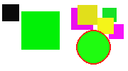

# ASIS Cyber Security Contest Finals 2014: Match the pair

**Category:** Web, PPC
**Points:** 200
**Description:**

> Go here:
>
> <http://asis-ctf.ir:12443/>

## Write-up

When we visit the given url we find a page where we need to play the game memory. 
We get images with a circle in them and need to match the pairs that have the same circle color like the two examples below.
After beating 40 levels we can find the flag at `http://asis-ctf.ir:12443/flag`

There are 16 images (so 8 pairs) numbered 0 to 15 which can be found on `http://asis-ctf.ir:12443/pic/<pic number>`

Checking the page's javascript we find that when a user selects a pair the page sends a GET request to `http://asis-ctf.ir:12443/send?first=<pic number1>&second=<pic number2>"`

The server then responds with:
* __OK__ the pair is correct
* __e__ the pair is not correct
* __Done__ all pairs have been found, you can go to the next level

We then wrote [a script](match_the_pair.py) that downloaded all 16 images and uses [OpenCV](http://opencv.org/) to detect the circle so we could find the pairs.

Letting it run gave us the flag: `ASIS_28ca740e382225131fc0501d38cf5d30`

## Other write-ups and resources

* <http://blog.squareroots.de/en/2014/10/asis-finals-2014-match-the-pair-webppc-200/>
* <https://github.com/psmitty7373/ctf-writeups/tree/master/ASIS-2014/match_the_pair#readme>
