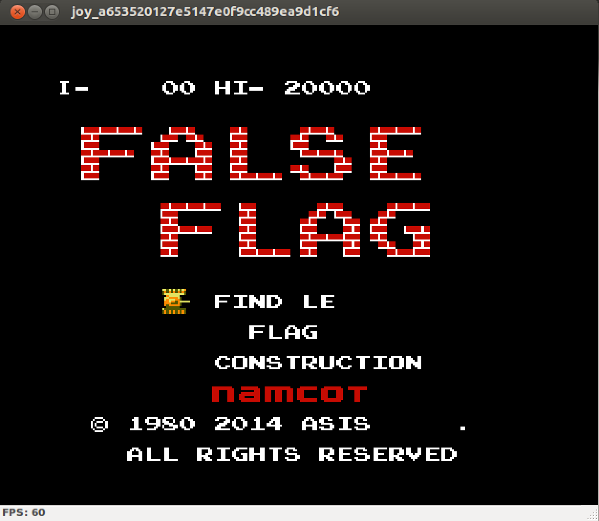
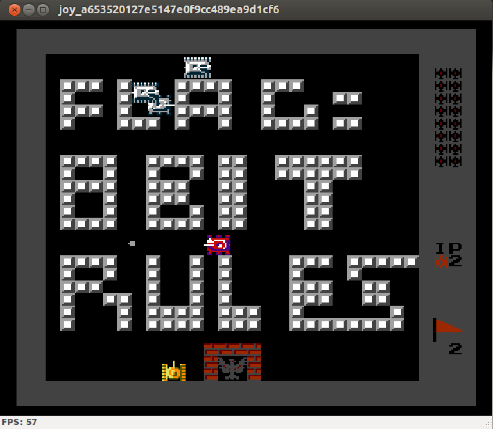
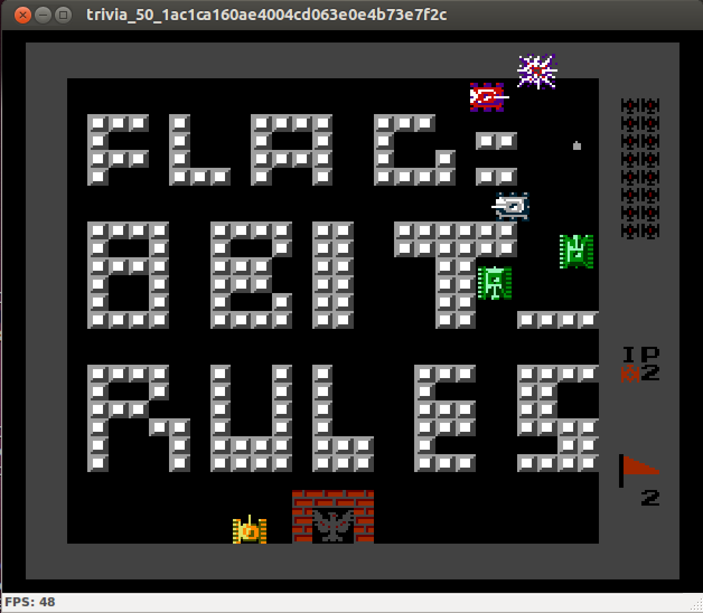

# ASIS Cyber Security Contest Quals 2014: Image

**Category:** Trivia
**Points:** 50
**Description:**

> Download the attached file and find the flag
> [file](joy_50_25b927e48a23a4b41f215303ca988a01)
> No need to calculate MD5 or appending `ASIS_`.

We are given the file `joy_50_25b927e48a23a4b41f215303ca988a01` without any extensions so the first thing we do is to run `file` command which gives us

> joy_50_25b927e48a23a4b41f215303ca988a01: xz compressed data

We can decompress it by running `tar` command with the following arguments

`tar -xv --xz -f joy_50_25b927e48a23a4b41f215303ca988a01`

and got the following output

> 1  
> x joy_a653520127e5147e0f9cc489ea9d1cf6

runing the `file` command again on extracted file gives us

> joy_a653520127e5147e0f9cc489ea9d1cf6: iNES ROM dump, 1x16k PRG, 1x8k CHR, [Horiz.]

so we can rename it to add a proper extension.

`mv joy_a653520127e5147e0f9cc489ea9d1cf6 joy_a653520127e5147e0f9cc489ea9d1cf6.nes`

Look like we need to found ourselves a SNES emulator. There are plenty of those available on the Internet for various OSes. A good place to start 
for finding tools to play with ROMs is [romhacking.net](http://www.romhacking.net), on Ubuntu though we can install [bsnes](https://apps.ubuntu.com/cat/applications/bsnes/) which is available via Ubuntu Software Center.

After loading the rom file we are presented with an old game of [Namco](http://en.wikipedia.org/wiki/Namco) - [Tank Battalion](http://en.wikipedia.org/wiki/Tank_Battalion) with some minor tweeks.

By playing a game and going through the first level we are shown with a map for level two.

Thus the flag should be: 8BIT RULES, but it did not work. 

Later (2014-05-10 01:31) during the competition the image file was [updated](trivia_50_88da3c57a7b4489036943d35d551cab2). Repeating the steps as described above gives us:

and the flag is 8BIT_RULES.

We do not need to play the game to get to second (or in that matter to any) level. On the level selction screen we can press X (bind to A button on SNES pad) to change level to 2.

## Other write-ups

* none yet
