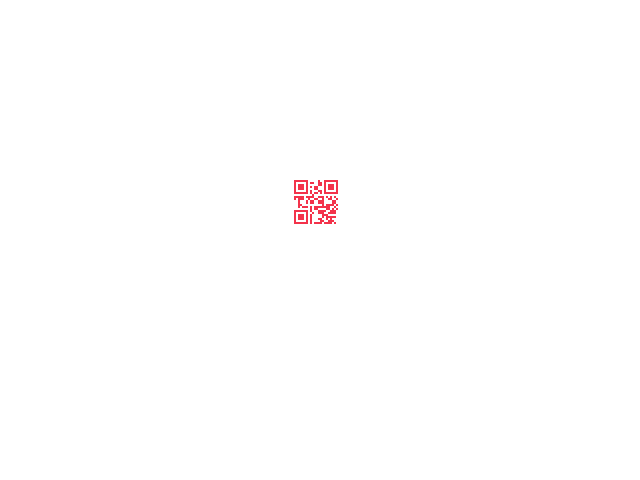

# tinyCTF 2014: Erik, Baleog and Olaf

**Category:** Steganography
**Points:** 100
**Description:**

> [Download file](stego100.zip)

## Write-up

Let’s extract the provided `stego100.zip` file:

```bash
$ unzip stego100.zip
Archive:  stego100.zip
  inflating: stego100
```

The extracted `stego100` file is a PNG image:

```bash
$ file stego100
stego100: PNG image data, 640 x 480, 8-bit/color RGB, non-interlaced
```

Let’s run `pngcheck` on it:

```bash
$ pngcheck -f -v -7 stego100.png
File: stego100.png (26857 bytes)
  chunk IHDR at offset 0x0000c, length 13
    640 x 480 image, 24-bit RGB, non-interlaced
  chunk IDAT at offset 0x00025, length 26753
    zlib: deflated, 32K window, maximum compression
  chunk tEXt at offset 0x068b2, length 35, keyword: hint
    http://i.imgur.com/22kUrzm.png
  chunk IEND at offset 0x068e1, length 0
No errors detected in stego100.png (4 chunks, 97.1% compression).
```

[That hint URL](https://i.imgur.com/22kUrzm.png) is [another image](hint.png) that looks the same:


Let’s diff it with the original `stego100.png` image using [ImageMagick’s `compare` command](http://www.imagemagick.org/script/compare.php):

```bash
$ compare hint.png stego100.png -compose src diff.png
```

[`diff.png`](diff.png) reveals a QR code:



Decoding the QR code gives `flag{#justdiffit}`, which is the flag.

## Other write-ups

Extract the provided `stego100.zip` file:

```bash
$ unzip stego100.zip
Archive:  stego100.zip
  inflating: stego100
```

Well, what is this?

```bash
$ file stego100
stego100: PNG image data, 640 x 480, 8-bit/color RGB, non-interlaced
```

Looks like it's a PNG image, hmmm... *looks at image*, not much here?...Let's see what else is in there:

```bash
$ strings stego100 | tail
`ML|w
{>+_O
l^$V
+{>6#4
-AQA
~?:,
LdfO;
#tEXthint
http://i.imgur.com/22kUrzm.png
IEND
```

Well look at that, a URL...*visits URL*...it's the same image... or is it!?

[That hint URL](https://i.imgur.com/22kUrzm.png) is [another image](hint.png) that looks the same:


```bash
$ diff stego100 22kUrzm.png
Binary files stego100 and 22kUrzm.png differ
```

Ah ha! So something is going on, let's write a script and see if we can find out what.

```python
#!/usr/bin/python

import numpy, Image

def dumpEachLayer(imageName):
  a1 = numpy.asarray(Image.open(imageName)) # pass Image
  for x in range(0, 255):
    Image.fromarray(numpy.asarray(map(lambda i: i & x, a1)), 'RGB').save('%d.png' % x)

def orEachUpperLower(func, imageOne, imageTwo, imageOut):
  a1 = numpy.asarray(Image.open(imageOne)) # pass Image
  a2 = numpy.asarray(map(lambda i: i & 0x0f, a1)) # lower 4 bits: 0x0f = 00001111
  a1 = numpy.asarray(Image.open(imageTwo)) # decoy Image
  a3 = numpy.asarray(map(lambda i: i & 0xf0, a1)) # higher 4 bits: 0xf0 = 11110000
  a4 = func(a2,a3) # bitwise or of both the images to reproduce 8 bit image.
  img = Image.fromarray(a4, 'RGB')
  img.save(imageOut)

def allBits(func, imageOne, imageTwo, imageOut):
  a1 = numpy.asarray(Image.open(imageOne)) # pass Image
  a2 = numpy.asarray(Image.open(imageTwo)) # decoy Image
  Image.fromarray(func(a1, a2), 'RGB').save(imageOut)

def sub(a1, a2):
  return a1 - a2

# Let's start out dumping all the layer's to see if there is anything there...
dumpEachLayer('stego100')
# Nope, all we got was a bunch of images...useless...

# Perhaps there is some funny things going on in the bits?
orEachUpperLower(numpy.bitwise_or, '22kUrzm.png', 'stego100', 'testOr.png')
orEachUpperLower(numpy.bitwise_xor, '22kUrzm.png', 'stego100', 'testXor.png')
orEachUpperLower(numpy.bitwise_and, '22kUrzm.png', 'stego100', 'testAnd.png')
# Nope...

# Okay...Hmmm, how about playing with all of the bits?
allBits(numpy.bitwise_or, '22kUrzm.png', 'stego100', 'testOr.png')
allBits(numpy.bitwise_xor, '22kUrzm.png', 'stego100', 'testXor.png')
allBits(numpy.bitwise_and, '22kUrzm.png', 'stego100', 'testAnd.png')
# Nope...

# Welp, we've two images - hell, let's subtract them.
allBits(sub, '22kUrzm.png', 'stego100', '22kUrzm-stego100.png')
allBits(sub, 'stego100', '22kUrzm.png', 'stego100-22kUrzm.png')
# MONEY!

```

[`diff.png`](diff.png) reveals a QR code:


Decoding the QR code gives `flag{#justdiffit}`, which is the flag.

## Other write-ups

